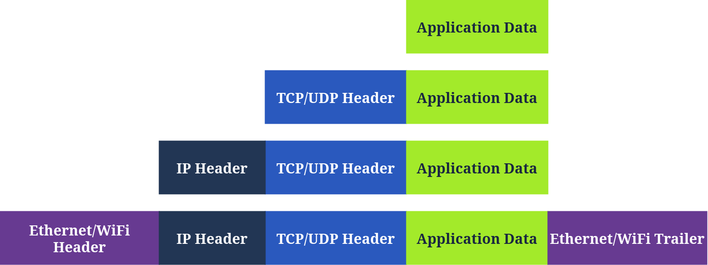

# Networking Concepts

## Overview

Learn about the ISO OSI model and the TCP/IP protocol suite.

## What I Learned

- OSI Model
- TCP/IP Model
- IP addresses and Subnet
- TCP and UDP 
- Encapsulation

## Exercises

### Exercise 1 — [ISO/OSI Model]

**Q1.** Which layer is responsible for end-to-end communication between running applications?
**Answer:** 4

**Q2.** Which layer is responsible for routing packets to the proper network?
**Answer:** 3

**Q3.** In the OSI model, which layer is responsible for encoding the application data?
**Answer:** 6

**Q4.** Which layer is responsible for transferring data between hosts on the same network segment?
**Answer:** 2

### Exercise 2 — [TCP/IP Model]

**Q1.** To which layer does HTTP belong in the TCP/IP model?
**Answer:** Application layer

**Q2.** How many layers of the OSI model does the application layer in the TCP/IP model cover?
**Answer:**  3

### Exercise 3 — [IP Addresses and Subnets]

**Q1.** Which of the following IP addresses is not a private IP address?

    192.168.250.125
    10.20.141.132
    49.69.147.197
    172.23.182.251
**Answer:** 49.69.147.197

**Q2.** Which of the following IP addresses is not a valid IP address?

    192.168.250.15
    192.168.254.17
    192.168.305.19
    192.168.199.13
**Answer:** 192.168.305.19

### Exercise 4 — [UDP and TCP]

**Q1.** Which protocol requires a three-way handshake?
**Answer:** TCP

**Q2.** What is the approximate number of port numbers (in thousands)?
**Answer:** 65

### Exercise 5 — [Encapsulation]

**Q1.** On a WiFi, within what will an IP packet be encapsulated?
**Answer:** Frame

**Q2.** What do you call the UDP data unit that encapsulates the application data?
**Answer:** Datagram

**Q3.** What do you call the data unit that encapsulates the application data sent over TCP?
**Answer:** Segment

### Exercise 6 — [Telnet]

**Q1.** Use telnet to connect to the web server on 10.49.182.248. What is the name and version of the HTTP server?
**Answer:** lighttpd/1.4.63

**Q2.** What flag did you get when you viewed the page?
**Answer:** THM{TELNET_MASTER}

## Key Takeaways

In this room, we covered the ISO OSI and /IP models, comparing and contrasting the two. We also covered IP addresses and subnets, briefly explaining routing. Furthermore, after diving into TCP and , we explained encapsulation. For demonstration purposes, we used telnet to “talk” to different servers over TCP.

## Notes

The OSI Model was developed by International Organization for Standardization (ISO) that describes how communication should occur in computer network

7 Layers of OSI Models are:
Layer 1 - Physical layer
Layer 2 - Datalink layer
Layer 3 - Network layer
Layer 4 - Transport layer
Layer 5 - Session layer
Layer 6 - Presentation layer
Layer 7 - Application layer

**TCP/IP Model:** Transmission Control Protocol/Internet Protocol Model was developed by Department of Defense in 1970s. One of the strength of this protocol is that it allows a network to continue to function as part of it are out of service.

**Application Layer:** The OSI Model application, presentation and session layer are merged together into application layer
**Transport Layer:** This is layer 4
**Internet Layer:** The network layer from OSI Model
**Link Layer:** This is layer 2
**Physical Layer(Optional):** In some Model this layer is included separately

RFC 1918 defines the following three ranges of Private IP address

10.0.0.0 - 10.255.255.255 (10/8)
172.16.0.0 - 172.16.255.255 (172.16/12)
192.168.0.0 - 192.168.255.255 (192.168/16)

Routing - A router forwards data packets to proper network

**Encapsulation:** Every layer adding a header is called as Encapsulation.
