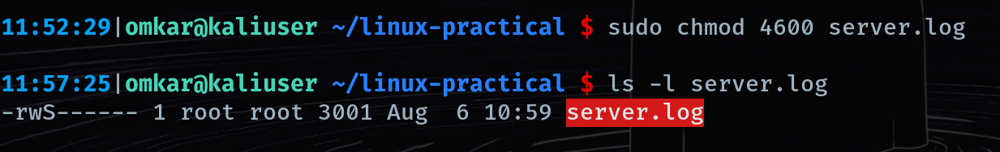

## `chmod` — Change Mode (Permissions)

**What it does:**
Changes who can Read, Write, or Execute a file/folder. This is the command version of the permissions theory (rwx, octal) your roadmap lists — they're taught together because chmod is meaningless without understanding what the permissions actually mean first.

**The theory you need before the syntax makes sense:**

Every file has three permission "slots" — owner, group, others — and each slot can have read, write, execute:
```
-rwxr-xr--
 │││ │ │ │
 │││ │ │ └─ others: r-- (read only)
 │││ │ └─── group:  r-x (read + execute)
 │││ └───── owner:  rwx (read + write + execute)

Each permission has a number: r=4, w=2, x=1. Add them per slot to get the octal number:

rwx = 4+2+1 = 7
r-x = 4+0+1 = 5
r-- = 4+0+0 = 4

So rwxr-xr-- = 754. This is the number you'll actually type.
```

**Syntax:**
chmod 755 filename        # owner: rwx, group: r-x, others: r-x
chmod 644 filename        # owner: rw-, group: r--, others: r-- (common default for files)
chmod +x filename         # shortcut: just add execute permission for everyone
chmod -x filename         # remove execute permission
chmod u+x,g-w filename    # fine-grained: u=user/owner, g=group, o=others
chmod -R 755 folder/      # -R = recursive, apply to everything inside a folder

**Example:**
11:15:40|omkar@kaliuser ~/linux-practical $ chmod 600 server.log 

**Why it matters for pentesting:**
The most common chmod moment of your life will be: you download an exploit script or tool, try to run it, and get Permission denied — because it downloaded without execute permission. chmod +x script.sh fixes it instantly. You'll do this dozens of times a week.
On the defensive/audit side, chmod misconfigurations are literally findings you'll write up — e.g. a config file with chmod 777 (world-writable) sitting in a web directory is a real, reportable vulnerability, because anyone can modify it.

**Notes / gotchas:**
This directly sets up SUID (Level 0 → Level 4 privesc territory): a file with the SUID bit runs with the owner's permissions, not the person executing it — that's how find / -perm -4000 hunting for SUID binaries becomes a privilege escalation technique. We'll get to that properly when we reach SUID itself, right after chown.

---

## `chown` — Change Owner
**What it does:**
Changes who owns a file or directory — both the user and, optionally, the group. Different from chmod, which controls what actions are allowed; chown controls who the permissions even apply to.

**Syntax:**
chown user filename            # change owner only
chown user:group filename      # change owner AND group
chown :group filename          # change group only
chown -R user:group folder/    # -R = recursive, apply to a folder and everything inside

**Example:**
11:35:33|omkar@kaliuser ~/linux-practical $ sudo chown root:root server.log 

**Why it matters for pentesting:**
This is where chmod and chown connect directly to SUID privilege escalation, which is next on your roadmap: a SUID binary owned by root with the SUID bit set runs as root, no matter who executes it. That combination — chown root:root + chmod u+s (SUID) — is exactly what makes a binary dangerous if it's something exploitable like find, vim, or cp. You'll be running find / -perm -4000 -user root 2>/dev/null to hunt for exactly this misconfiguration during privesc.
On engagements, you'll rarely set ownership on a target (that's usually not your job) — but you'll constantly read ownership with ls -l to figure out what you can and can't touch, and to spot misconfigured files owned by higher-privileged users that you happen to have write access to.
On your own Kali box, you'll use chown after copying files as root accidentally (e.g. via sudo cp) and needing to hand them back to your normal user so you can edit them without sudo every time.

**Notes / gotchas:**
Notice chown almost always needs sudo — you can't give away ownership of a file you don't already control-level own, and you definitely can't hand yourself ownership of root's files without privilege.

---

## `SUID` — Set User ID
**What it does:**
A special permission bit that makes an executable run with the permissions of the file's owner, not the permissions of whoever is running it. Normally when you run a program, it runs with your privileges. SUID breaks that rule — if root owns the file and SUID is set, the program runs as root even when a regular user executes it.

**Why this exists (legitimately):**
Some system programs genuinely need elevated access to do their job even when a normal user runs them. Classic example: /usr/bin/passwd — when you change your own password, it needs to write to /etc/shadow, a file only root can normally touch. SUID lets passwd do that write on your behalf, safely, because the program itself controls exactly what gets modified.

**Syntax:**
chmod 4755 filename       # the leading 4 = SUID
chmod u+s filename        # symbolic equivalent

**Example:**
11:35:33|omkar@kaliuser ~/linux-practical $ sudo chown root:root server.log 


**Why it matters for pentesting:**
The single command you'll run on almost every Linux privesc:
bash
  find / -perm -4000 -type f 2>/dev/null

This searches the entire filesystem for SUID binaries, discarding permission errors (2>/dev/null). You're hunting for a binary owned by root, with SUID set, that you can abuse.

The exploitability comes down to which binary has SUID. If it's something like /usr/bin/find, /usr/bin/vim, /usr/bin/less, or /usr/bin/cp with SUID set — all of these have known ways to spawn a root shell or read/write arbitrary files, because their normal functionality can be abused while running as root. GTFOBins (gtfobins.github.io) is the reference site you'll use constantly here — look up any SUID binary you find and it tells you the exact abuse technique.
This is also exactly what LinPEAS automates and flags for you — but you need to understand why it's flagging it, not just trust the tool's output, especially for your reporting and for interview questions.

**Notes / gotchas:**
If SUID is set but the owner doesn't have execute permission underneath it, you'll see a capital S instead — meaning SUID is set but effectively broken/unusable.

---

## `SGID` — Set Group ID

**What it does:**
Similar to SUID, but for the group instead of the owner. On an executable, it runs with the permissions of the file's group instead of the group of whoever runs it. On a directory, it does something different and arguably more useful for you day-to-day: any new file created inside that directory automatically inherits the directory's group, instead of the creating user's default group.

**Syntax:**
chmod 2755 filename        # the leading 2 = SGID
chmod g+s filename          # symbolic equivalent
chmod g+s foldername        # commonly used on directories

**Example:**
12:10:33|omkar@kaliuser ~/linux-practical $ chmod g+s backup 

12:10:44|omkar@kaliuser ~/linux-practical $ ls
backup      employees.csv  n2    num2         output.txt  saved       temp
carlos.php  kids           num1  numbers.txt  revision    server.log

12:10:45|omkar@kaliuser ~/linux-practical $ ls -l backup 
-rw-rwSr-- 1 omkar omkar 10273 Aug  6 10:50 backup

**Why it matters for pentesting:**
Same find hunt as SUID, just a different flag: find / -perm -2000 -type f 2>/dev/null. SGID binaries are rarer as privesc vectors than SUID, but when you find one owned by a privileged group, GTFOBins is still your reference for whether it's abusable.
On directories, SGID matters more in team/shared engagement setups — if a team is dropping loot files into a shared folder on a jump box, SGID on that folder keeps every file consistently owned by the right group instead of each teammate's personal group, which avoids permission headaches mid-engagement.

**Notes / gotchas:**
On a directory, g+s behaves completely differently from on a file — inheritance, not "run as." Don't confuse the two when you're scanning find output; you need -type f if you're specifically hunting privesc-relevant SGID executables, otherwise you'll get directories mixed into your results.

---

## `Sticky Bit`

**What it does:**
Applies to **directories only**. When set on a directory, it restricts deletion — even if multiple users have write access to that directory, each user can only delete or rename **their own** files inside it, not anyone else's. Without the sticky bit, having write access to a directory means you can delete *any* file in it, regardless of who owns the individual file.

**Syntax:**
```
chmod 1755 dirname        # the leading 1 = sticky bit
chmod +t dirname           # symbolic equivalent
```

**Example:**
12:10:48|omkar@kaliuser ~/linux-practical $ sudo chmod 1755 .

`/tmp` is the textbook real-world example — it's world-writable (`rwxrwxrwx` for others) because every user and process needs to drop temp files there, but the sticky bit stops one user from deleting or overwriting another user's files sitting in the same folder.

**Why it matters for pentesting:**
Less of a direct privesc vector than SUID/SGID, but it's a permissions concept you're expected to recognize and explain correctly — interviewers do ask "what's the sticky bit and where have you seen it" as a basic filter question. Knowing `/tmp` has it by default (and why) is the standard answer.
It also matters when you're staging exploit files or payloads in `/tmp` on a target during an engagement — the sticky bit is *why* another logged-in user (or a monitoring process) can't casually delete your dropped files, but it also means you can't casually delete *theirs* if you're trying to clean up a shared temp directory.

**Notes / gotchas:**
Easy to mix up with SUID/SGID since all three use that same "extra digit in front" octal trick (4/2/1). Quick mental anchor: **SUID = run as owner, SGID = run as group (or inherit group on dirs), sticky = restrict delete on shared dirs.** They can technically be combined (e.g. `7`= all three), though that's rare in practice.

---
